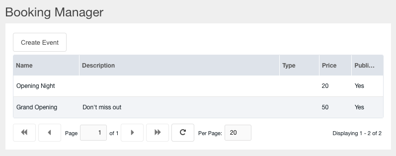
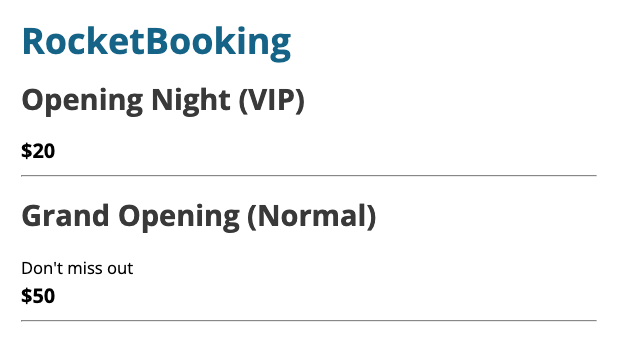
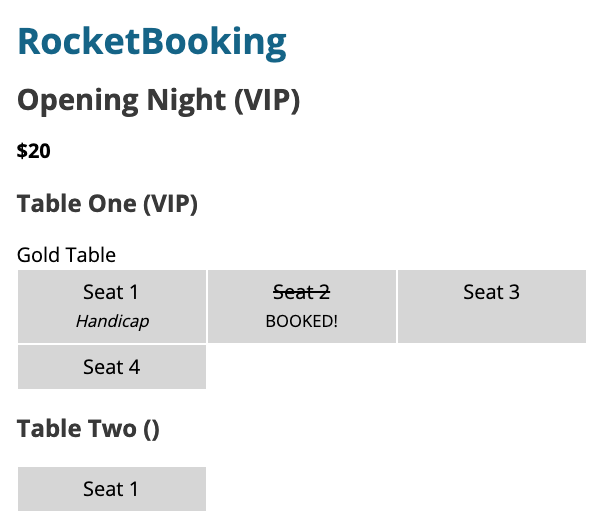
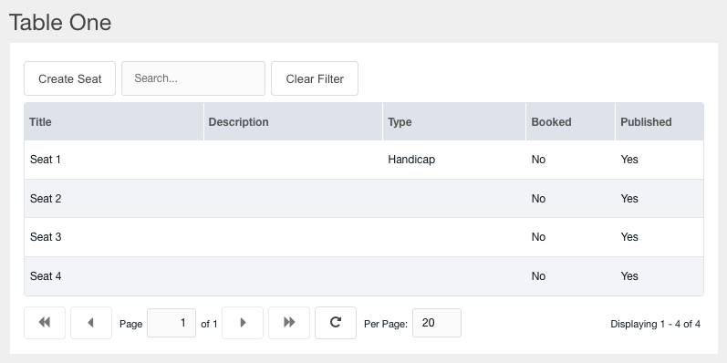
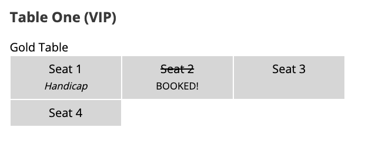

# Rocket Booking

> A MODX extra for Booking Tables per seat per Event


Some basic CSS for the seats.

```
.rocket-booking_seats{display:flex;flex-wrap:wrap;}
.rocket-booking_seat{width:27.1%;flex-basis:27.1%;background-color:#dedede;text-align:center;padding:.5rem 1rem;border:1px solid #FFF;}
```

## Display All Events

```
[[RocketBooking]]
```





## Display Tables of a Specific Event

```
[[RocketBookingTables? &event_id=`4`]]
```



## Display Seats of a Specific table

```
[[RocketBookingSeats? &table_id=`5`]]
```




